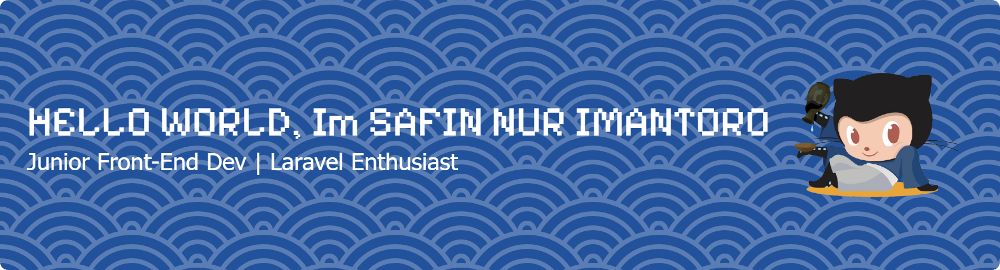

###

<h3 align="left">💻 Junior Front-End Developer | 🌱 Laravel Enthusiast</h3>

###

<h2 align="left">👨‍💻 About Me</h2>

###

###

I'm a passionate Junior Front-End Developer currently studying at Universitas Buana Perjuangan Karawang. My main focus is on creating clean, modern, and user-friendly web interfaces.  ✨ Currently, I'm exploring:  Front-End Development with React & Vue Back-End fundamentals with Laravel Framework Building full-stack web applications step by step  🌍 I enjoy learning new technologies, contributing to projects, and solving real-world problems with code. I aim to grow as a developer who can deliver impactful digital solutions.

###

###

<h3 align="center">🔧 TECH STACK</h3>

###

###

  
  
  
  
  
  
  
  
  
  
  
  
  
  
  
  
  
  
  
  
  
  
  

###

<h3 align="left">📫 Connect with Me :    📧 Email: if23.safinimantoro.ubpkarawang.ac.id</h3>

###

<picture>
  <source media="(prefers-color-scheme: dark)" srcset="https://raw.githubusercontent.com/SafinNurImantoro/SafinNurImantoro/output/pacman-contribution-graph-dark.svg">
  <source media="(prefers-color-scheme: light)" srcset="https://raw.githubusercontent.com/SafinNurImantoro/SafinNurImantoro/output/pacman-contribution-graph.svg">
  
</picture>

###